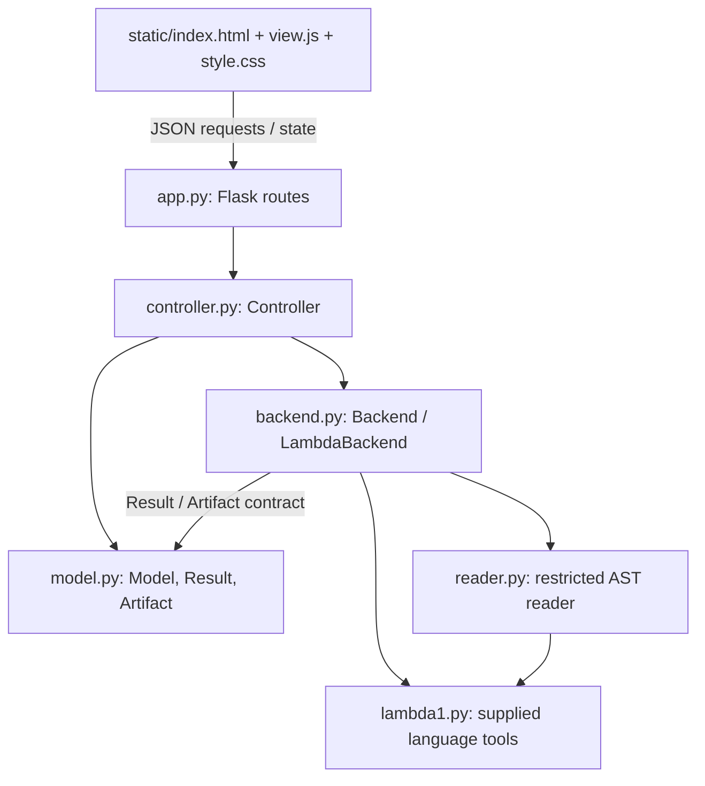

# Architecture

## Components and dependency direction

The arrows represent calls or imports; JSON connects the browser to HTTP routes. 
`app.py` adapts HTTP to controller commands and serves static view files. 
It does not own source state or invoke the interpreter. 
There is no dependency from the model or controller to Flask, HTML, DOM objects, or the view. 
`lambda1.py` is copied exactly.

## MVC responsibilities

| Responsibility | Actual implementation | Owns / does |
| --- | --- | --- |
| Model | `model.py`: `Model`, `Result`, `Artifact` | Applied source/name/revision, editable draft, results, busy flag, artifact; validation and state transitions |
| View | `static/index.html`, `view.js`, `style.css` | Accessible controls, literal editor/output, JSON forwarding, busy polling and immediate interaction guards |
| Controller | `controller.py`: `Controller.request`, `work`, `state` | Dispatches source transitions and tools, supplies backend inputs, records results, catches adapter failures |
| HTTP boundary | `app.py`: `create_app`, `make_server` | Flask routes, JSON decoding, response headers, static assets, loopback server |
| Backend adapter | `backend.py`: `Backend`, `LambdaBackend`, `compute`, `worker` | Reads constructors, calls real Lint/Interpret, reports placeholders, bounds work in child processes |
| Restricted reader | `reader.py`: `read`, `SCHEMA` | Whitelisted AST traversal and positional argument validation, without `eval` or `exec` |

## Source and operation state

The model distinguishes applied source from draft source. 
Dirty drafts prevent replacement and tool execution in the model even if a caller bypasses disabled browser controls. 
A successful upload, canned load, or Apply increments revision and clears results/artifacts. 
A failed validation changes only the draft/notice; previous applied source, name, revision, results, and artifact survive. 
Invalid UTF-8 has no valid text representation, so its bytes stay in the original local file and the previous editor content is preserved. 
Manual input begins a blank draft; Discard restores the previous applied source.

The controller starts work under the model lock, captures source/revision, and runs the adapter in a background thread. 
The real adapter starts a separate spawned process. 
HTTP state polling continues during computation. 
Source changes and competing tools are rejected while busy. 
Completion, exceptions, worker death, and timeout all produce a result and release busy state. 
A backend result with the wrong operation or revision becomes a backend failure.

## Backend responsibilities

| Entry point | Input | Required response |
| --- | --- | --- |
| `lint(source, revision)` | Applied UTF-8 constructor text and revision | Parse, call `d0exp_fvset`; closed source succeeds; sorted nonempty free variables produce `language_error` |
| `interpret(source, revision)` | Same | Parse, call `d0exp_evaluate(expression, ENVnil())`; return textual value or diagnostic |
| `typecheck(source, revision)` | Same | `not_implemented`, with explicit message |
| `compile(source, revision)` | Same | `not_implemented`; no artifact |
| `execute(artifact)` | Compiler-produced `Artifact` | Reserved generated-code operation; currently `not_implemented` and unreachable through normal application state |

Each immutable `Result` has `operation`, `revision`, `outcome`, and `text`. 
Outcomes are `success`, `input_error` (syntax/restricted-reader violation), `language_error` (undeclared variables or unsupported lint expression), `runtime_error` (evaluation exception or sentinel), `backend_failure` (timeout, worker/infrastructure failure, invalid adapter response), and `not_implemented`.
A validation or unavailable-operation rejection appears as status text rather than pretending that the tool ran. 
Lint never calls the evaluator. 
The supplied free-variable function returns `frozenset`; the adapter sorts names for display.
An exact `D0V000` value, including one nested anywhere in a `D0Vpair`, is an error.
Closures are real values, not sentinels merely because they inherit `D0V000`.

## Load → Lint → Interpret trace

1. The view sends a canned load or upload command. The controller calls `Model.replace`; successful validation commits revision r and clears results.
2. The user clicks Lint. `Model.begin` checks applied source, clean draft, and idle state; the controller dispatches `backend.lint(source, r)` asynchronously.
3. The reader constructs the expression; `d0exp_fvset` traverses its lexical structure. For `D0Evar("x")`, the result is `frozenset({"x"})`; the adapter returns `language_error: Undeclared variables: x` without evaluation.
4. The controller records that result and releases busy state. The view displays Lint, revision r, outcome, and literal diagnostic. Interpret remains available independently; on this open source it returns a runtime sentinel diagnostic.
5. Editing to `D0Eint(42)` and applying creates r+1 and clears the old result. Lint now reports no free variables. Interpret parses the applied text, calls the supplied evaluator with `ENVnil`, and displays `D0Vint(arg1=42)` at r+1.

## Decisions and tradeoffs

**Controller coordinates tools; model enforces transitions.** 
Keeping backend calls out of the model makes state tests deterministic and allows a test backend without changing view code. 
This introduces explicit begin/finish coordination and a lock, but avoids tying business state to Flask or interpreter details.

**Spawned processes plus polling.** 
A two-second deadline can terminate CPU-bound or nonterminating language work while the page and server remain responsive. 
Process startup and 100 ms polling cost more than a direct call; they are simple and sufficient for a local single-user application. 
Threads alone could not reliably stop a stuck evaluator. 
Work output is truncated to 16,000 characters; source is capped at 32,768 UTF-8 bytes, AST nodes at 4,000, and nesting at 80.

## Future type checking, compilation, and Execute

Replace the two placeholder adapter methods with actual language tools; the view still submits the same operation identifiers and renders the same result fields.
For compilation, extend the adapter response to a typed pair of `Result` and an optional `Artifact(revision, format, payload)`. 
Define `format` as a supported compiler target/version identifier and `payload` as compiler-produced bytes, never arbitrary uploaded Python or shell code. 
The controller must validate the artifact's revision and install it only on successful compilation. 
The model already clears artifacts on source commit and when compilation begins, so a failed recompilation cannot leave stale code available. 
Execute must consume the stored same-revision artifact directly in a target-specific bounded runner, without recompiling or interpreting source. 
No compiler, fake artifact, or real generated-code execution is included in this required implementation.
